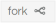
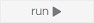

# 3D Javascript - CoderDojo Leiden

## Uitleg

In de bijgeleverde opdrachten leer je hoe je met Javascript een 3D spel kan maken. 

De complete challenge bestaat uit 7 opdrachten. Het is de bedoeling dat je de opdrachten op volgorde maakt, want iedere opdracht gaat verder waar de vorige is gebleven.

Omdat deze challenge gebruik maakt van een aantal **libraries** (voorgeprogrammeerde hulpmiddelen die het makkelijker maken om complexe taken te programmeren) is het belangrijk dat je niets weggooit wat in de opdracht-folder staat.
De enige file die je in elke opdracht hoeft aan te passen is `index.js` en alleen onder de volgende regel: 

<pre><code><i>// ******** SCHRIJF AL JE CODE NA DEZE REGEL ********</i></code></pre>

### Code toevoegen

Als er in de opdracht staat dat je code moet **toevoegen**, dan wordt er altijd bij vermeldt waar je de code moet toevoegen. Let hier goed op, want als je de code op de verkeerde plaats toevoegt, dan zal het programma waarschijnlijk niet werken. In de opdracht kan bijvoorbeeld staan (maak je niet druk om wat de code doet, dat wordt in de opdrachten uitgelegd): 

*"Voeg de volgende code toe direct na de regel `scene.add(ball);`"*

<pre><code>ball.position.set(-250, 250, -250);</code></pre>

### Code veranderen
Als er in de opdracht staat dat je code moet **veranderen**, dan wordt er van je verwacht dat je alleen de **vetgedrukte** code aanpast. Bijvoorbeeld: in het onderstaande stuk code is alleen het cijfer **250** vetgedrukt. Dit betekent dat je alleen het cijfer dat op die plek stond moet vervangen door *250*, de rest van de code blijft dus gelijk.

<pre><code>var shape = new THREE.SphereGeometry(<b>250</b>);</code></pre>

## Bron en libraries

Deze opdrachten zijn afgeleid van het boek [3D Game Programming for Kids](https://pragprog.com/book/csjava/3d-game-programming-for-kids) van Chris Strom. Als je geinteresseerd bent geraakt in spellen bouwen met javascript, dan kan ik je dat boek van harte aanbevelen. Het bevat naast de opdrachten die je hier al hebt gedaan nog veel meer leuke dingen die je kunt bouwen. Het boek is wel in het engels, dus daar moet je wel rekening mee houden.

Tijdens de opdrachten maak je gebruik van twee libraries, `THREE.js` en `TWEEN.js`. Als je wilt weten wat deze libraries nog meer kunnen dan wat je in de opdrachten hebt geleerd, dan kun je hier meer informatie vinden:

* https://threejs.org/
* https://github.com/tweenjs/tween.js

## De opdrachten

Je gaat de opdrachten maken in een online text editor, zodat er helemaal niets op je computer geinstalleerd hoeft te worden. In de editor staan alle bestanden die je nodig hebt om de opdrachten te maken.

Ga als volgt te werk om met de eerste opdracht te beginnen:

 1. Ga naar <a href="https://repl.it/@Dickvan/CoderDojo-3djs" target="_blank">https://repl.it/@Dickvan/CoderDojo-3djs</a>
 2. Klik op de  knop. Dit maakt een copy van de startsituatie zodat je online kan werken zonder de startsituatie voor anderen kapot te maken.
 3. Klik in het linker-venster op `index.js`. Dit opent het bestand in het middelste venster, zodat je er in kan werken.
 4. Klik op de link naar opdracht 1 hieronder. Nu kun je aan de slag!

 Als je jouw werk wilt uitproberen, klik dan op de  knop. Als alles goed is gegaan zie je het resultaat in het rechter venster. Vind je dit venster wat klein, klik dan op de  knop. Dit opent het resultaat in een nieuwe tab, zodat je het wat beter kan bekijken.

Elke keer als je jouw code wijzigt en je wilt het resultaat bekijken, dan moet je opnieuw op de  knop klikken. Als er geen `run` knop staat, maar een `stop` knop, klik die dan eerst in en daarna `run`.

Hier is de lijst met opdrachten. Op elke opdracht pagina staat links naar de volgende en de vorige opdracht en een link terug naar deze uitleg.

 1. [opdracht 1 - figuren tekenen](opdracht1.md)
 2. [opdracht 2 - een avatar maken](opdracht2.md)
 3. [opdracht 3 - de avatar besturen](opdracht3.md)
 4. [opdracht 4 - de avatar animeren](opdracht4.md)
 5. [opdracht 5 - de avatar draaien](opdracht5.md)
 6. [opdracht 6 - botsingen](opdracht6.md)
 7. [opdracht 7 - fruit hunt](opdracht7.md)

### Uitwerkingen

Mocht je er niet uitkomen, ga dan naar: [https://github.com/dvhirtum/coderdojo-3djs](https://github.com/dvhirtum/coderdojo-3djs). Hier staat alle code van deze challenge, inclusief uitwerkingen van alle opdrachten. Ga naar de folder van de opdracht waar je mee bezig bent en open de folder met de naam  **uitwerking**.
